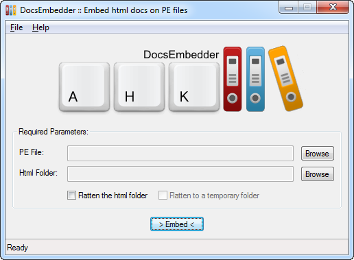

# DocsEmbedder

**PLEASE NOTE THAT THIS IS BETA SOFTWARE. I'M IN NO WAY RESPONSIBLE FOR ANY DATA LOSS.**

  

*DocsEmbedder* is a tool that allows to embed a set of documentation files, html related, inside a **PE** (portable executable) file. The documentation can then be referenced and visualized using the **res://** protocol with a compatible browser or ActiveX control.

One of the way to embed a documentation is to write the desired markdown files, build a site with [MkDocs](http://www.mkdocs.org/) and then embed the resulting files with *DocsEmbedder*, flattening them first. This document is actually embedded in the binary release of *DocsEmbedder* and can be visualized clicking on its **Help** menu item.

### Download

The build archive is [here on GitHub](https://github.com/cyruz-git/DocsEmbedder/releases).

### Files

Name | Description
-----|------------
docs\ | Folder containing the documentation, built with MkDocs.
COPYING | GNU General Public License.
COPYING.LESSER | GNU Lesser General Public License.
DocsEmbedder.ahk | Main source file.
Icon.ico | Program's icon file.
LibSetup.ahk | Libraries setup script.
Logo.png | Program's logo file.
README.md | This document.

### How to compile

*DocsEmbedder* should be compiled with the **Ahk2Exe** compiler, that can be downloaded from the [AHKscript download page](http://ahkscript.org/download/).

Run the `LibSetup.ahk` script in advance to retrieve the required libraries from GitHub.

Browse to the files so that the fields are filled as follows:

    Source:      path\to\DocsEmbedder.ahk
    Destination: path\to\DocsEmbedder.exe
    Custom Icon: path\to\Icon.ico

Select a **Base File** indicating your desired build and click on the **> Convert <** button. Don't use **MPRESS**.

Embed the documentation into the resulting exe using the script version of the program.

The documentation site is built with [MkDocs](http://www.mkdocs.org/).

### Full README available [here](docs/docs/index.md)
