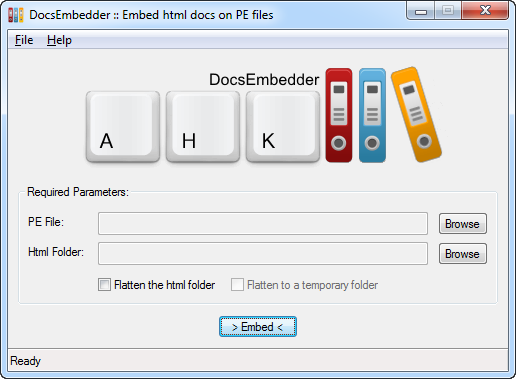
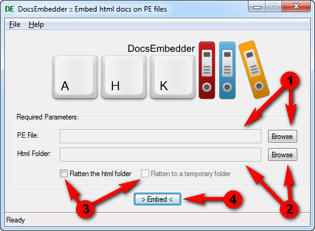

# DocsEmbedder

**PLEASE NOTE THAT THIS IS BETA SOFTWARE. I'M IN NO WAY RESPONSIBLE FOR ANY DATA LOSS.**

{: .imgcenter }

*DocsEmbedder* is a tool that allows to embed a set of documentation files, html related, inside a **PE** (portable executable) file. The documentation can then be referenced and visualized using the **res://** protocol with a compatible browser or ActiveX control.

One of the way to embed a documentation is to write the desired markdown files, build a site with [MkDocs](http://www.mkdocs.org/) and then embed the resulting files with *DocsEmbedder*, flattening them first. This document is actually embedded in the binary release of *DocsEmbedder* and can be visualized clicking on its **Help** menu item.

### How it works

*DocsEmbedder* loops over a desired directory, loading all files and embedding them inside the desired PE file, through the Win32 [UpdateResource](http://msdn.microsoft.com/en-us/library/windows/desktop/ms648049%28v=vs.85%29.aspx) function. Because of a documentation site being often structured in multiple subfolders, *DocsEmbedder* can **flatten** the desired directory, moving all subfolders files to the root directory and changing all the **href** and **src** attributes in the html files according to the new structure. A **temporary folder** can be used to avoid any change to the actual files.

*DocsEmbedder* can embed the files in a pre-existing PE file or generate a new one with the desired name and extension. The generated file is a hardcoded executable, compiled with Visual C++ 2010 Express, optimized to keep the size less than 1 KB. If run, the generated executable shows a message box and returns.

### Remarks

* There could be issues if the documentation is embedded on a **compressed** executable that already contains resources. The correct behaviour would be to embed the documentation first and then compress the executable, or use a standalone file.

* The site must be **flat** (all the resources must reside in the root folder) because of the limitations of the PE format. The flattening feature of the program must be used if the documentation site cannot be organized in a single flat folder.

* All the resources will be stored inside the PE file using their **filename** (with extension) as resource name, **RT_HTML** as resource type and a **neutral** language identifier. 

* Because of some limitations of the **res://** protocol, filenames cannot contain exclusively digits (or/and spaces), so they must be named carefully. E.g. "001.png" doesn't work, "img001.png" works.

* The embedded files can be referenced only by a compatible viewer (like **Internet Explorer**).

### Setup and usage

There is nothing to setup in *DocsEmbedder*. It is ready to use:

{: .imgcenter }

1. Select the desired PE file, clicking on the first **Browse** button. If you want to use a standalone file, just use a free filename in the current directory, no matter the extension.

2. Select the desired folder containing the html related files, clicking on the second **Browse** button. 

3. Flag the **"Flatten the html folder"** checkbox if you need to flatten the selected folder. If you don't want to modify the source files, flag the **"Flatten to a temporary folder"** checkbox.

4. Click on the **Embed** button and wait for the popup confirmation.

The documentation can now be accessed on any client compatible with the **res://** protocol, using the following address:

    res://C:\path\to\pefile/resourcename

E.g. If the choosen PE file is **test.exe** and the embedded resource is **index.html**, the address is the following:

    res://C:\path\to\test.exe/index.html

### License

*DocsEmbedder* is released under the terms of the [GNU General Public License](http://www.gnu.org/licenses/). The program logo contains an icon from the [Pretty Office Icon Set Part 7](http://www.customicondesign.com/free-icons/pretty-office-icon-set/pretty-office-icon-set-part-7/), released under the term of [CustomIconDesign License Agreement](http://www.customicondesign.com/license-agreement/).

### Contact

For hints, bug reports or anything else, you can contact me at [focabresm@gmail.com](mailto:focabresm@gmail.com), open a issue on the dedicated [GitHub repo](https://github.com/cyruz-git/DocsEmbedder) or use the [AHKscript development thread](http://ahkscript.org/boards/viewtopic.php?f=6&t=5918).